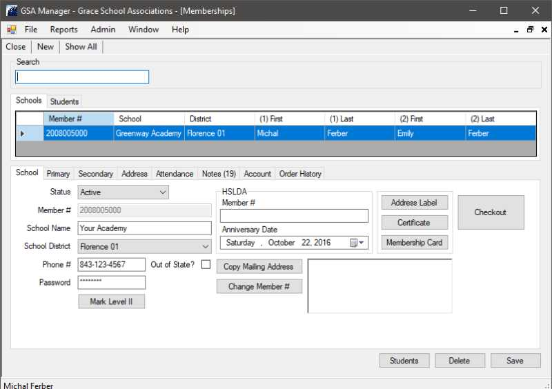

# GSA Manager

GSA Manager is an associational and club management application. This Windows application comes complete with membership, inventory, checkout and contact management. It comes ready to go with Authorize.net or Braintree for payment processing. GSA Manager can use card swipes, cash drawers, bar code scanners as well as label and receipt printers.

Customizations can be done on a case by case basis. This application can also be used for your small business, great for any bookstore or consignment shop.

*Demo databases are available on request*

Installation files can be found [here](https://gsamanager.org/install/publish.htm)
