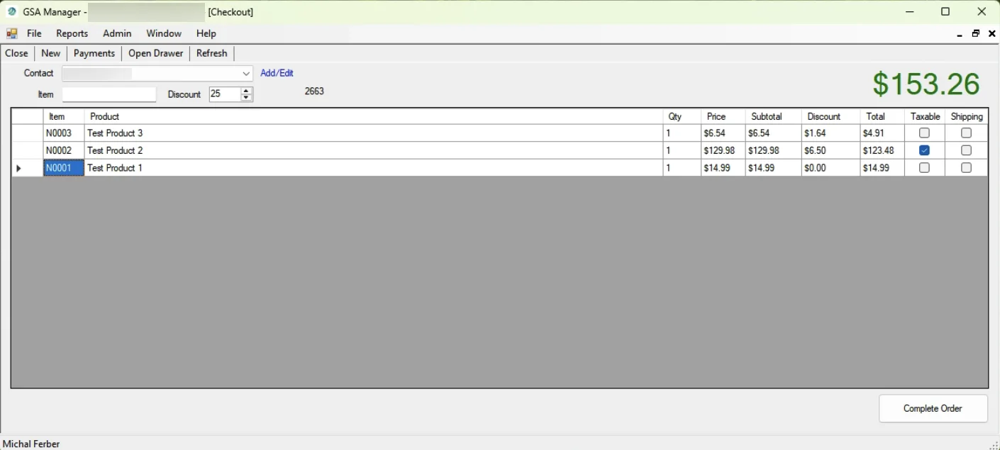
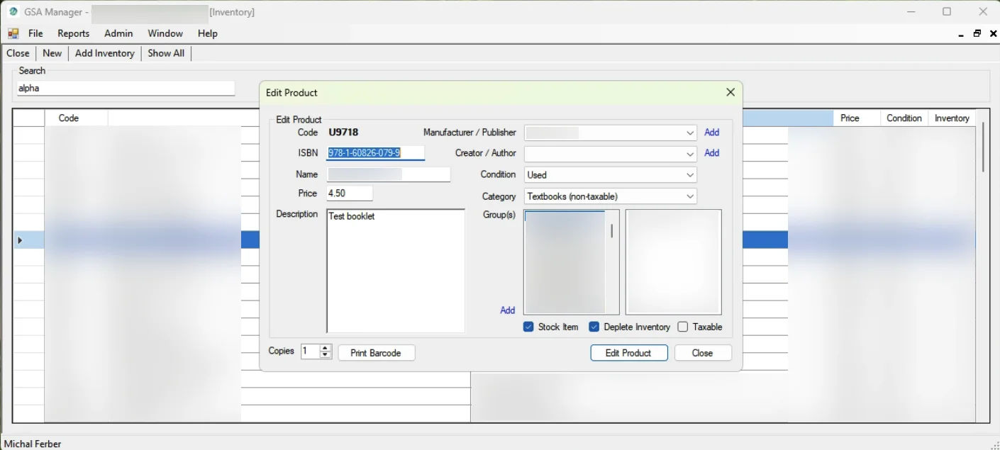
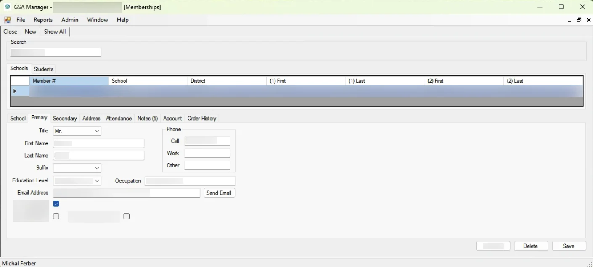
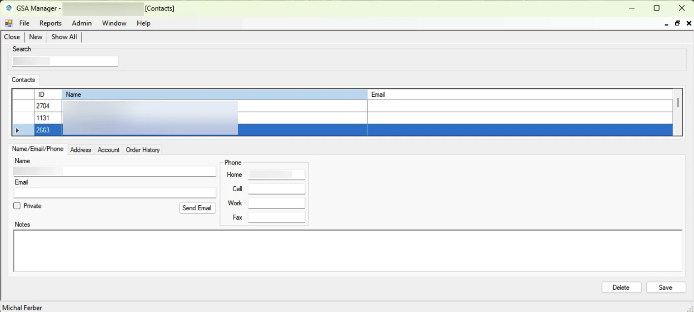
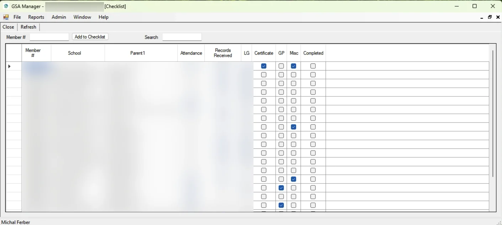
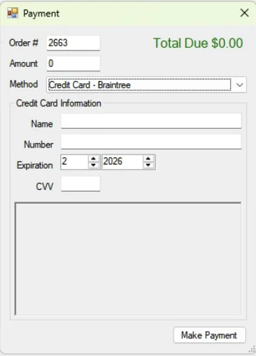

# GSA Manager
{: .fs-9 }

All-in-one business management software for associations, clubs, bookstores, and consignment shops.
{: .fs-6 .fw-300 }

[Request a Demo](#contact){: .btn .btn-primary .fs-5 .mb-4 .mb-md-0 .mr-2 }
[Install GSA Manager](install/publish.htm){: .btn .fs-5 .mb-4 .mb-md-0 }

---

GSA Manager is a cloud-based SaaS application hosted on the Microsoft Azure platform. Actively developed since 2007 and still trusted by its very first customer, it brings together point of sale, inventory, CRM, task management, and payment processing into one streamlined solution. Pricing is based on your specific needs and any customizations required.

<nav class="page-toc" markdown="block">
**On this page**
{: .text-delta }
- TOC
{:toc}
</nav>

---

## Point of Sale

Ring up sales, apply discounts, open the cash drawer, and complete orders all from one screen. Supports barcode scanners, receipt printers, and cash drawers.

---

## Inventory Management

Track products with detailed records including ISBN, categories, conditions, pricing, and stock levels. Print barcode labels directly from the inventory screen.

---

## CRM & Membership Management

Manage your members and contacts with a full CRM. Store contact details, addresses, notes, account history, and order records. Track attendance, school affiliations, and more.

---

## Checklist & Task Tracking

Keep your team on track with built-in checklists. Track progress across customizable columns with a simple checkbox workflow.

---

## Payment Processing

Accept credit card payments directly through the app with integrated payment gateways.

- [Authorize.Net Payment Gateway](https://www.authorize.net/)
- [Braintree Payment Gateway](https://www.braintreepayments.com/)

---

## Hardware Support

GSA Manager works with the hardware you already have.

- [APG Cash Drawers](https://www.cashdrawer.com/software-drivers-developers/)
- [Dymo Label Printers](https://www.dymo.com/en-US)
- [Zebra Barcode Scanners](https://www.zebra.com/us/en/products/scanners/general-purpose-scanners/handheld/ls2208.html)

---

## Software Requirements

- [.NET Framework 4.8](https://go.microsoft.com/fwlink/?linkid=2088631)
- [Crystal Reports for Visual Studio SP30 Runtime 32-bit MSI](https://origin-az.softwaredownloads.sap.com/public/file/0020000000195592021)
- [DYMO Label Software 8.7.4](https://s3.amazonaws.com/download.dymo.com/dymo/Software/Win/DLS8Setup8.7.4.exe)
- [GSA Support Files](GSA%20Manager.zip)

---

## Contact
{: #contact }

Interested in GSA Manager? Request a demo or ask about pricing and customizations.


